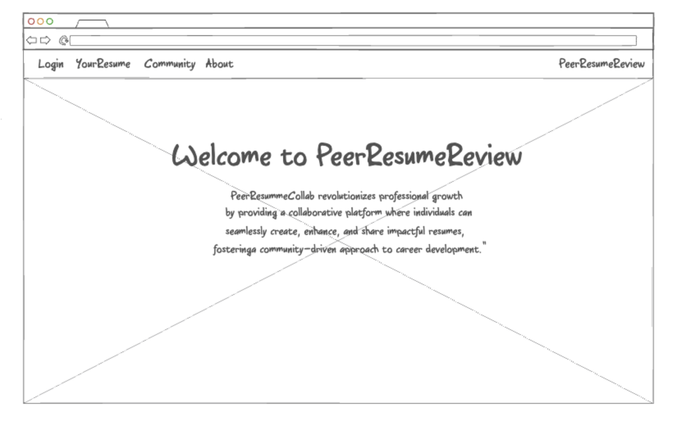
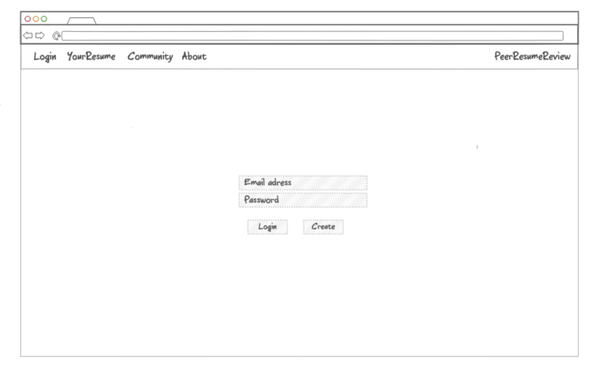
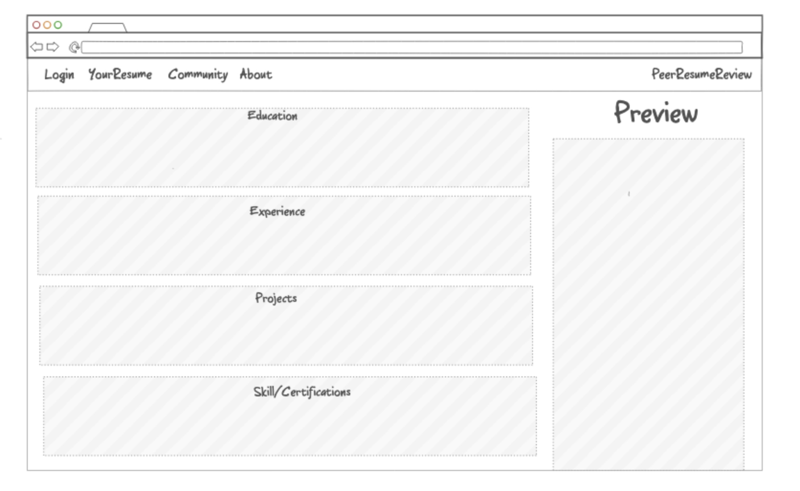
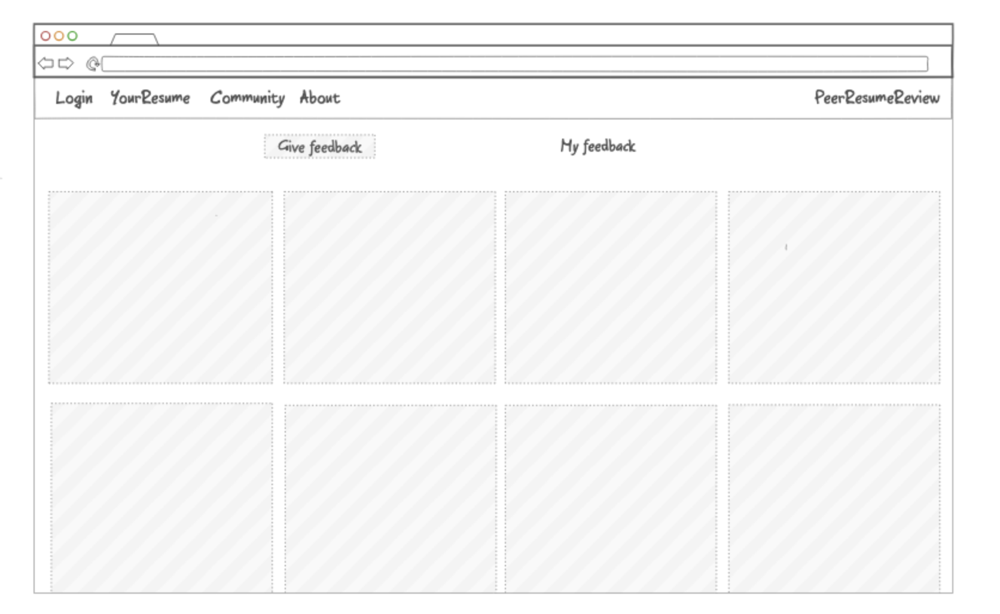
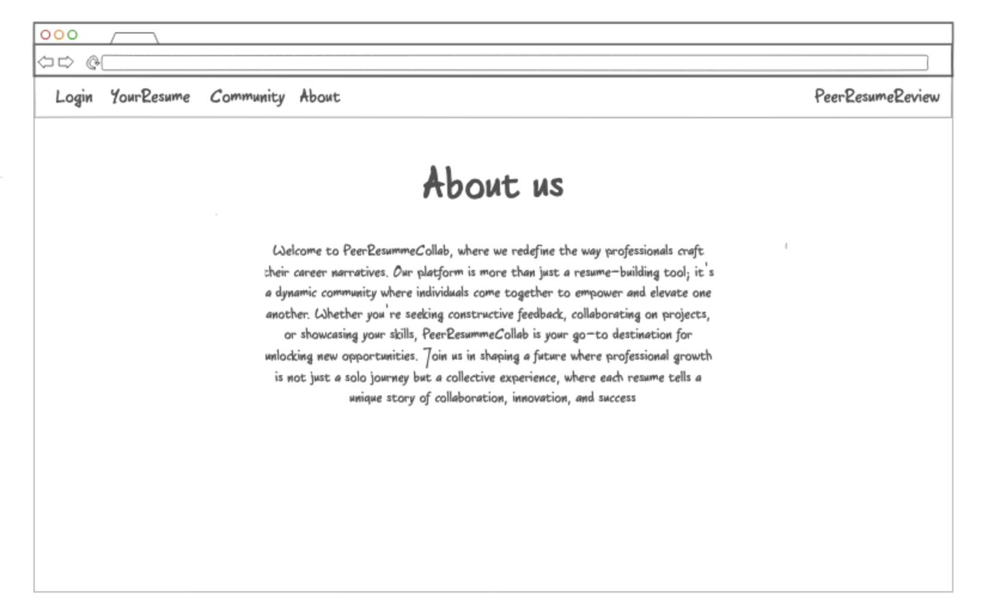

# Startup: PeerResumeReview
## Project Description
### Elevator Pitch
Introducing PeerResummeCollab, where crafting a standout resume becomes a collaborative journey. Our platform empowers individuals to effortlessly create professional resumes while fostering a community-driven atmosphere. Seamlessly seek and provide constructive feedback, allowing your career story to shine. Join PeerResummeCollab to elevate your resume-building experience through the power of collaborative excellence.
### Design

### Specific Aspects
- User Profiles: Use HTML, CSS, and JavaScript to create visually appealing and informative user profiles. Enable users to fill in details about their skills, interests, and availability for projects.
- Search and Matching Algorithm: Implement a web service for searching and matching users with relevant projects based on their skills and preferences. This can involve complex algorithms to ensure optimal project recommendations.
- Project Listings: Develop a project listing section that displays available projects, project descriptions, requirements, and deadlines. Real-time updates should be supported through web sockets.
- User Interaction: Enable users to interact with each other and with projects through real-time messaging. This requires web sockets to facilitate instant communication.
- Authentication and Security: Implement secure user registration and login using authentication technologies. Ensure data security and privacy compliance.
- Project Creation: Allow users to create and manage projects, set permissions, and invite potential collaborators.
- Persistent Data Storage: Store user profiles, project details, and real-time communication logs in a database for future reference and retrieval.
## HTML, CSS, JavaScript
Use HTML, CSS, and JavaScript to create an intuitive and user-friendly front-end interface for your app. Ensure that the design is responsive and visually appealing.
## Providing Web Services
Integrate web services and APIs to fetch and display information about college students, their skills, and available projects. This could involve using APIs for user authentication and data retrieval.
## Calling Web Services
Develop the back-end of the app to provide web services for user registration, project creation, and user collaboration. Implement APIs to support these functions.
## Login
Implement a secure authentication system to allow users to register, log in, and manage their profiles. Consider using technologies like OAuth or JWT for secure authentication.
## WebSocket
Utilize web sockets to enable real-time communication between users. This can be essential for instant messaging, project updates, and collaboration. Users should receive real-time notifications about new project proposals or messages from potential collaborators.
## Data storage
Set up a database to store user profiles, project details, and other relevant data persistently. Use a reliable database management system (e.g., MySQL, PostgreSQL, MongoDB) to ensure data integrity and security.
# Create a server:
Log in: https://aws.amazon.com/es/ 
Summary:
-  Create a server
-  Buy a domain
-  Change the security using caddy
#### Steps
-  EC2
-  Chanfe region to  to US East (N. Virginia) - us-east-1
-  Launch Instance
-  Select t3.nano, t3.micro, or t2.micro
-  Create a new key pair
-  auto-assign public IP
-  For the Firewall (security group) select the option to Create security group
-  Open your browser and paste the public IP address
### Console
-  ssh -i [key pair file] ubuntu@[ip address]
-   ls -l
-  Should look like this:
-     total 4
      lrwxrwxrwx 1 ubuntu ubuntu   20 Apr 13 15:06 Caddyfile -> /etc/caddy/Caddyfile
      lrwxrwxrwx 1 ubuntu ubuntu   16 Apr 13 15:06 public_html -> /usr/share/caddy
      drwxrwxr-x 4 ubuntu ubuntu 4096 Apr 13 16:48 services
### Elastic Ip
-  Open the AWS console in your browser and log in.
-  Navigate to the EC2 service.
-  From the menu on the left select Network & Security|Elastic IPs.
-  Press the Allocate Elastic IP address button.
-  Press the Allocate button.
-  Select the newly displayed allocated address and press the Actions button.
-  Select the Associate Elastic IP address option.
-  Click on the Instance box and select your server instance.
-  Press Associate.

# Purchase a domanin name:
-  Route 53
-  Domain
-  Registered domains
-  Register domain
-  Write down the domain name: .click and .link are the cheapest
-  Add to cart and buy
# DNS Records:
-  Route 53
-  HOsted zones
-  Domains
-  Pending requests
-  A type
-  Create record
-  A type
-  Copy the ip address and paste it on search with https:// on the front
# Caddy:
Web service to host the webpage
### Http to HTTPS
More security, encrypted
-  Console
-  ssh -i [key pair file] ubuntu@[yourdomainnamehere]
-  ssh -i ~/keys/production.pem ubuntu@myfunkychickens.click
-  cd ~
- i Caddyfile
- example:
-     myfunkychickens.click {
       root * /usr/share/caddy
       file_server
       header Cache-Control no-store
       header -etag
       header -server
       }
      startup.myfunkychickens.click {
         reverse_proxy * localhost:4000
         header Cache-Control no-store
         header -server
         header -etag
         header Access-Control-Allow-Origin *
      } 
      simon.myfunkychickens.click {
         reverse_proxy * localhost:3000
         header Cache-Control no-store
         header -server
         header -etag
         header Access-Control-Allow-Origin *
      }
-  save and exit w this command: :wq
-  sudo service caddy restart
-  try to open the ip addreess with https:// on the front
-  
